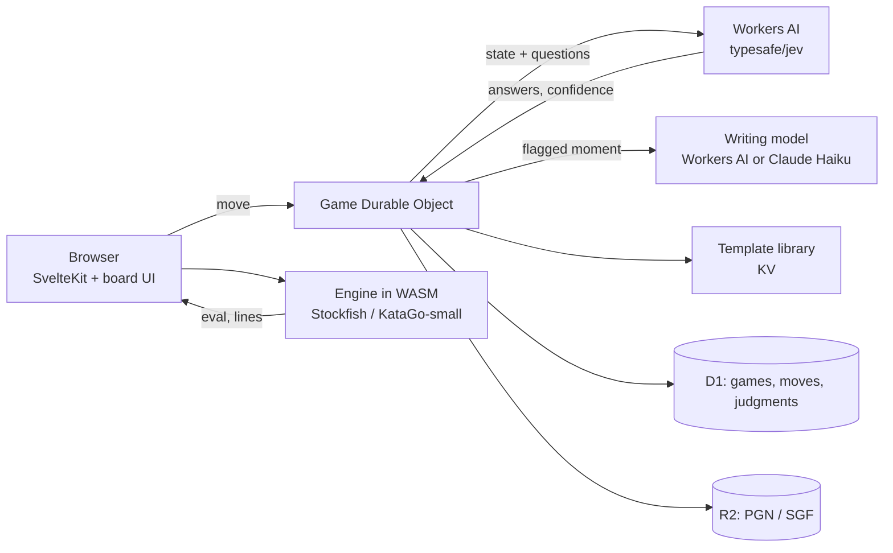

# GameCoach Web — Jev-driven coaching PRD (ChessMentor + GoSensei)

2026-09-18 · @Someone · Draft v0.1

## Summary

GameCoach Web is a browser-based chess coaching app that runs entirely on Cloudflare and coaches a full game for under 2 cents. The MVP is chess only; Go follows once chess proves the coaching model. It is a fresh SvelteKit build with a shared coaching core, reusing the design systems and SKILL.md files from the ChessMentor and GoSensei desktop apps.

The design has three layers with strict roles. The engine (Stockfish, KataGo) owns truth about the position. TypeSafe's Jev model owns judgment: after every player move it answers a fixed set of typed questions about severity, error class, timing and what to teach. A template library and a small writing model own the words.

Jev makes this affordable. At $0.042 per million input tokens with free output and 70–500 ms latency, a per-move judgment call costs a fraction of a cent and returns before the player's next move. A chat model in the same seat would cost 50–400x more and arrive too late to coach live.

## Goals and non-goals

Goals

- Coach live, during play, with feedback inside the player's move rhythm (under 1 s end to end).
- Keep marginal cost under $0.05 per chess game, all in.
- Run the whole stack on Cloudflare: Pages, Workers, Durable Objects, D1, R2, KV, Workers AI.
- Build the coaching core game-agnostic from day one so Go can be added later by writing an engine adapter, board UI and content, with no changes to the Jev layer or data model.
- Make coaching decisions measurable: every Jev judgment is logged with the engine facts it saw, so calibration can be tested offline.

Non-goals

- Jev never evaluates positions or picks moves. The engine does that.
- No free-form chat with the coach in v1. Explanations are templated or generated from a fixed brief.
- No multiplayer or matchmaking. v1 is player vs. engine and imported-game review.
- No Go in the MVP. Go is a later phase, gated on chess meeting its calibration and retention targets.
- No native mobile app. The web app must work on phone and tablet browsers.
- Not a replacement for the desktop apps' deep analysis modes. Those stay in Tauri.

## Users and core jobs

The primary user is an improving club-level player (chess 1000–1800 Elo, Go 15k–3k) who wants to know what they keep getting wrong, not just that a move was bad.

| Job | What the player needs | How the product answers it |
| --- | --- | --- |
| Play and learn | A game against the engine with a coach that speaks only when it matters | Live coaching with interrupt thresholds set per player |
| Review a game | The three moments that decided the game, explained | Post-game report with ranked moments and written explanations |
| Fix a pattern | Drills on the mistake class I keep making | Training queue fed by Jev's error-class labels across games |
| Track progress | Evidence that a weakness is shrinking | Per-class error rate over time, shown per player |

## Product principles

1. Engine owns truth. Every evaluation, best line and swing number comes from Stockfish or KataGo. Jev never overrides or re-estimates them.
2. Jev owns judgment. Severity, error class, whether to interrupt, which template, which drill, and confidence on each. These are fuzzy calls that engines cannot make and chat models make too slowly.
3. Code owns the workflow. Thresholds, weighting and the final action live in TypeScript, not in a prompt. Changing behavior is a config change, not a prompt rewrite.
4. Words are cheap and last. Most feedback is a template with engine facts substituted. A writing model is called only for moments Jev flags as worth it, capped per game.
5. Silence is a feature. The coach interrupts only above a per-player severity threshold. Everything else waits for the post-game review.
6. Every judgment is auditable. Each Jev call and its answers are stored with the exact state block sent, so calibration can be measured and thresholds tuned from real games.

## System architecture on Cloudflare

Everything runs on Cloudflare: SvelteKit on Workers for the UI, a Durable Object per game for state and coaching, Jev through the Workers AI binding (`env.AI.run('typesafe/jev', …)`), D1 for records, R2 for game files, KV for opening and joseki tables.

The browser runs the engine and sends the Durable Object each player move together with the engine's evaluation before and after, the top lines and the swing. The DO builds Jev's state block, calls Jev, applies thresholds, and pushes a coaching event back over the same WebSocket. Nothing about the position is re-derived server side.

| Component | Cloudflare service | Role |
| --- | --- | --- |
| Web app | Workers (SvelteKit adapter) | Board, clock, coaching panel, review and training views |
| Game session | Durable Object | One per live game; holds state, WebSocket, Jev call budget, interrupt thresholds |
| Judgment | Workers AI `typesafe/jev` | Typed questions per move; 32k context window, third-party model billed through AI Gateway / Unified Billing |
| Words | Workers AI text model or Claude Haiku via AI Gateway | Explanations for flagged moments and the post-game narrative, capped per game |
| Records | D1 | Players, games, moves, judgments, drills, progress |
| Files | R2 | PGN/SGF import and export |
| Reference | KV | Opening book, joseki tables, template library, threshold config |
| Engine (Go, strong) | External CPU box or Container | Only if in-browser KataGo proves too weak; see Engine layer |

Source: [Cloudflare docs, Jev model page](https://developers.cloudflare.com/ai/models/typesafe/jev/).

## Engine layer

Chess runs entirely in the browser at zero server cost. Go is deferred to a later phase; the two tiers below record the plan so the adapter interface is designed for it now.

| Game | Engine | Where it runs | Strength / speed target | Cost |
| --- | --- | --- | --- | --- |
| Chess | Stockfish 17 WASM (multi-thread, NNUE) + chess.js for legality | Browser Web Worker | Depth 18–22 in under 1 s on a laptop; depth 14–16 on phone | $0 |
| Go, casual tier | KataGo WASM with a small net (b6 or b10) | Browser Web Worker | \~100–300 playouts per move; enough for severity and swing on 9x9 and 13x13, marginal on 19x19 | $0 |
| Go, strong tier | KataGo with b18 net, CPU (Eigen) build | Cloudflare Container or a $10–20/mo VPS behind a Worker | 19x19 review quality; shared across all users, queued per request | \~$15/mo fixed |

The engine adapter is a single interface: `analyse(position) → { evalBefore, evalAfter, swing, bestLines[], phase, features }`. Chess features: material, king safety, pawn structure flags, mobility, tactic motifs present. Go features: territory estimate, group liberties, ko status, sente/gote, life-and-death flags.

The adapter also decides what Jev sees. It compresses the position to under 1,500 tokens for chess and under 2,500 for Go so a full game stays far under Jev's 32k context and the per-call cost stays flat.

Open question for the Go phase: whether KataGo-small in WASM gives usable swing numbers on 19x19 for club players. Decide with a 50-game test against the b18 reference when that phase starts.

## Jev decision layer

One Jev call per player move, one state block, eleven typed questions answered in parallel. Jev's three question types map directly onto coaching decisions: `noul` for yes/no probabilities, `choice` for classification, `score` for ordinal severity.

State block (JSON, under 1,500 tokens for chess)

- `game`: chess or go, board size, time control, move number, phase
- `position`: FEN or compact board string; last 6 moves in SAN or GTP
- `engine`: eval before and after the move, swing in centipawns or win-rate points, best line, the line actually played, depth reached
- `features`: engine-derived flags (hanging piece, back-rank weakness, ko active, group in atari, …)
- `player`: rating band, error-class rates over last 20 games, interrupt threshold, moves since last coaching event
- `clock`: time used on this move vs. the player's median

Question set

| Key | Type | Question | Used for |
| --- | --- | --- | --- |
| severity | score | How bad was this move: fine / inaccuracy / mistake / blunder | Interrupt decision, review ranking |
| error\_class | choice | tactical oversight, positional, endgame technique, opening prep, time pressure, calculation depth, unclear | Training queue, progress tracking |
| interrupt\_now | noul | Should the coach speak before the next move? | Live coaching gate |
| teachable | noul | Is this worth a written explanation, not a template? | Writing-model budget |
| template | choice | Which of up to 100 coaching templates fits best | Live message text |
| theme | choice | Which training theme to queue (fork, pin, back rank, weak squares, ko, life-and-death, endgame counting, …) | Drill selection |
| repeat\_pattern | noul | Does this match a mistake class the player makes often? | Escalate emphasis |
| good\_move | noul | Was this a strong or well-judged move worth praising? | Positive reinforcement |
| missed\_tactic | noul | Was there a concrete tactic the player missed? | Puzzle generation from own games |
| complexity | score | How hard was the position: simple / moderate / sharp | Calibrating expectations by rating |
| confidence\_override | noul | Does the engine swing overstate the practical error for this rating? | Suppress noise from theoretical evals |

Decision rules in code, not in the prompt

1. Interrupt if `interrupt_now` ≥ player threshold (default 0.7) and `severity` ≥ 2 and confidence ≥ 0.6. Otherwise queue for review.
2. Call the writing model only if `teachable` ≥ 0.8, and at most 3 times per game. Everything else uses `template`.
3. Log all eleven answers with the state block on every call, whether or not the coach speaks.
4. If any answer's confidence is below 0.4, the coach stays silent and the moment is flagged for review with a "low confidence" tag.

Jev cannot see images, so board state is always textual. The 255-choice ceiling is more than enough for templates and themes.

## Coaching content

Most of what the player reads is a template with engine facts filled in. Templates are authored once, versioned in KV, and selected by Jev's `template` answer.

Template library

- 60–100 templates per game at launch, one per (error class × phase × severity) cell that occurs often, plus praise and neutral variants.
- Each template has slots the DO fills from engine output: `{best_move}`, `{swing}`, `{piece}`, `{square}`, `{group}`, `{liberties}`, `{line}`.
- Example, chess: "Before {played}, check what {best\_move} does to {target\_square}. You gave up about {swing} here."
- Example, Go: "{group} is down to {liberties} liberties. {best\_move} keeps it connected; {played} leaves it cuttable."
- Each template maps to one training theme so the drill queue needs no extra call.

Writing-model escalation

- Triggered only when `teachable` ≥ 0.8; hard cap 3 per game plus 1 for the post-game narrative.
- Input is a fixed brief, not the whole game: position, played vs. best line, Jev's severity and error class, the template it would have used, player rating band. Under 800 tokens.
- Model: Workers AI hosted text model by default (keeps everything on one bill); Claude Haiku via AI Gateway as the quality option. Output capped at 120 words for live moments, 300 for the narrative.
- The writing model never sees engine-free positions and is told to explain, not evaluate.

Training themes

- One fixed list per game, under 40 entries, shared between `theme` choices and the drill library.
- Drills come from two sources: a curated set per theme, and the player's own missed tactics (`missed_tactic` ≥ 0.8) turned into puzzles with the engine's line as the solution.

## Player experience

Three surfaces: play, review, train. All three read from the same judgment log.

Live play

- Board with engine opponent at a chosen level. Coaching panel beside or below the board on phone.
- The coach speaks only on interrupts. A short template line appears with the key square or group highlighted; the player can tap for the best line.
- A quiet indicator shows the coach is watching (last judgment: fine / noted for review) without words.
- Player controls: coach off, review-only, or live with a threshold slider (quiet to talkative).

Post-game review

- Ranked list of moments by severity × confidence, top three expanded with written explanations.
- Every player move shows its severity chip and error class; tapping shows the engine line and the template.
- One narrative paragraph on the game's story and the one pattern to work on.

Train

- Drill queue ordered by `repeat_pattern` frequency across the last 20 games.
- Progress view: error rate per class over time, from the judgment log.

Import

- Paste or upload PGN/SGF. Review runs the same per-move pipeline without the live clock, so imported games cost the same as played ones.

## Data model and storage

D1 holds five tables; the judgment table is the product's real asset because it makes calibration measurable.

| Table | Key columns | Notes |
| --- | --- | --- |
| players | id, game, rating\_band, thresholds (JSON), created\_at | Thresholds are per player and per game |
| games | id, player\_id, game, source (played / imported), result, r2\_key, started\_at | PGN/SGF lives in R2 |
| moves | game\_id, ply, san\_or\_gtp, eval\_before, eval\_after, swing, best\_line, features (JSON), clock\_ms | Written by the DO from engine output |
| judgments | move\_id, jev\_model, state\_hash, answers (JSON), latency\_ms, input\_tokens, action\_taken | One row per Jev call; the full state block is stored in R2 keyed by state\_hash |
| coaching\_events | game\_id, ply, kind (interrupt / review / praise), template\_id, text, source (template / model) | What the player actually saw |

KV holds the template library, theme list, opening and joseki tables, and threshold defaults, all versioned by key prefix.

The Durable Object keeps the live game in memory and writes to D1 in batches at game end, plus a checkpoint every 10 moves so a dropped connection loses nothing.

## Cost model

A coached chess game costs about 1.5 cents; Jev is the smallest line. The Go column is kept for the later phase. Figures use TypeSafe's list price of $0.042 per million input tokens with free output; Cloudflare's Jev price is shown only in the dashboard and should be confirmed in Milestone 0.

| Item | Chess (40 player moves) | Go 19x19 (120 player moves) | Basis |
| --- | --- | --- | --- |
| Jev judgments | $0.003 | $0.013 | 1,500 / 2,500 tokens per call × moves × $0.042/M |
| Writing model, 3 moments + narrative | $0.008 | $0.008 | ~~4 × 800 in / 200 out tokens at Haiku-class rates (~~$1 / $5 per M) |
| Durable Object, D1, R2, KV | under $0.001 | under $0.002 | Well inside Workers Paid included quotas at hobby scale |
| Engine compute | $0 | $0 (WASM) or \~$0.01 (shared KataGo box at 1,500 games/mo) | Browser WASM; VPS amortized |
| Total per game | \~$0.012 | \~$0.023–0.033 |  |

Fixed monthly: Workers Paid $5, optional KataGo VPS $10–20, domain. At 1,000 games a month the whole service runs for roughly $20–40 including the Go box.

Sensitivities

- Chat-model replacement: the same per-move judgment with a Haiku-class model costs 50–100x more on tokens and adds 1–3 s latency. With a Sonnet-class model, 300–500x. This is the case for Jev.
- Doubling questions per call adds little; Jev evaluates them in parallel against one state. Doubling state size doubles Jev cost, which is why the adapter compresses positions.
- The writing-model cap is the main cost dial. Lifting it from 3 to 10 moments per game roughly triples the total.

Sources: [RuntimeWire on Jev pricing and latency](https://runtimewire.com/article/typesafe-jev-system-one-ai-model-early-access); [Cloudflare Jev model page](https://developers.cloudflare.com/ai/models/typesafe/jev/).

## Calibration and evaluation

Jev's schema guarantee means it never returns a malformed answer; it does not mean the answer is right. Ship only after measuring agreement against a labeled set, then keep measuring from the judgment log.

Baseline set, before any UI work

- 200 chess player moves with engine facts attached, hand-labeled for severity, error class and interrupt-worthiness. Source: Joel's own annotated games from ChessMentor plus public annotated games. A 100-move Go set is built when the Go phase starts.
- Run the full question set through Jev on Cloudflare and score each question separately.

Acceptance thresholds for v1

| Question | Metric | Target |
| --- | --- | --- |
| severity | Exact agreement with label | ≥ 80%; adjacent-level errors ≥ 95% |
| error\_class | Top-1 agreement | ≥ 70% (seven classes) |
| interrupt\_now | Precision at threshold 0.7 | ≥ 85% (false interrupts are the worst failure) |
| teachable | Precision at 0.8 | ≥ 75% |
| all | Calibration: stated confidence vs. observed accuracy, 10 bins | Within 10 points in every bin |

Ongoing

- Every 500 logged judgments, sample 50 for hand review. Track drift per question and per Jev model version (`jev_model` is stored on every row).
- Player feedback: a one-tap "helpful / not helpful" on each live interrupt feeds a second label stream.
- Thresholds are tuned from the log, per rating band, without touching the question set.

## Milestones

Four chess milestones make the MVP; the first two are cheap and decide whether the rest is worth building. Go is a separate phase with its own gate.

| # | Milestone | Deliverable | Exit test |
| --- | --- | --- | --- |
| 0 | Jev on Cloudflare works | One Worker calling `typesafe/jev` with a real chess state block; dashboard price confirmed | 11 questions answered in under 500 ms; cost per call logged |
| 1 | Calibration baseline | 200 labeled chess moves, scoring script, report per question | Acceptance table met |
| 2 | Chess vertical slice | SvelteKit board, Stockfish WASM, Durable Object, live interrupts with templates, D1 logging | Play a full game with coaching under 1 s per event; cost under $0.02 |
| 3 | Review, train, writing model — MVP complete | Post-game review, drill queue, writing-model escalation with cap, PGN import | Narrative and top-3 moments on any imported PGN |
| Gate | Chess proves out | 4 weeks of real use | Interrupt "helpful" rate ≥ 70%; players return for a second session ≥ 50% |
| 4 | Go phase | KataGo adapter and tier decision, Go templates and themes, 9x9 / 13x13 / 19x19; 100-move Go calibration set | Same tests as chess on 19x19 with chosen engine tier |

Stack: SvelteKit, TypeScript, pnpm, Wrangler. Fresh build, not a port: the Rust engine bridge and Tauri command layer have no Cloudflare equivalent. Carried over from the desktop apps: The Study and The Grid design systems, the SKILL.md files, and Joel's annotated games as the calibration set. The `coaching-core` package is game-agnostic from the start so the Go phase adds an adapter, not a rewrite.

## Risks and open questions

| Risk | Impact | Mitigation |
| --- | --- | --- |
| Jev's classification quality is worse than TypeSafe's internal evals suggest | Coach interrupts wrongly; players turn it off | Milestone 1 gate; precision-first thresholds; silence on low confidence |
| Jev is early access; Cloudflare routes it as a third-party model through AI Gateway with Unified Billing | Availability or billing surprises | Keep a direct TypeSafe transport behind the same interface; log every failure |
| KataGo in WASM too weak on 19x19 | Go tier needs a server box | Budgeted at $10–20/mo; decision in Milestone 1 |
| Template library feels canned | Players want real explanations | Writing-model cap is a dial; measure "helpful" rate and raise the cap for paying users |
| State block leaks engine bias into Jev | Jev rubber-stamps the swing | `confidence_override` question and rating-band calibration exist for this |
| Cloudflare Jev price differs from TypeSafe list | Cost model off | Confirm in Milestone 0; cost model is 30x under target even at 10x price |

Open questions

- [ ] Confirm Cloudflare's per-token price for `typesafe/jev` and whether Unified Billing is required.
- [ ] Does `@typesafe-ai/sdk` run on Workers, or do we call `env.AI.run` directly? Direct binding is the default assumption.
- [ ] Which Workers AI text model is good enough for the writing role, vs. Claude Haiku through AI Gateway?
- [ ] Free tier for players, or gated behind an account from day one?
- [ ] Should the Tauri desktop apps adopt `coaching-core` so both share templates and themes?
